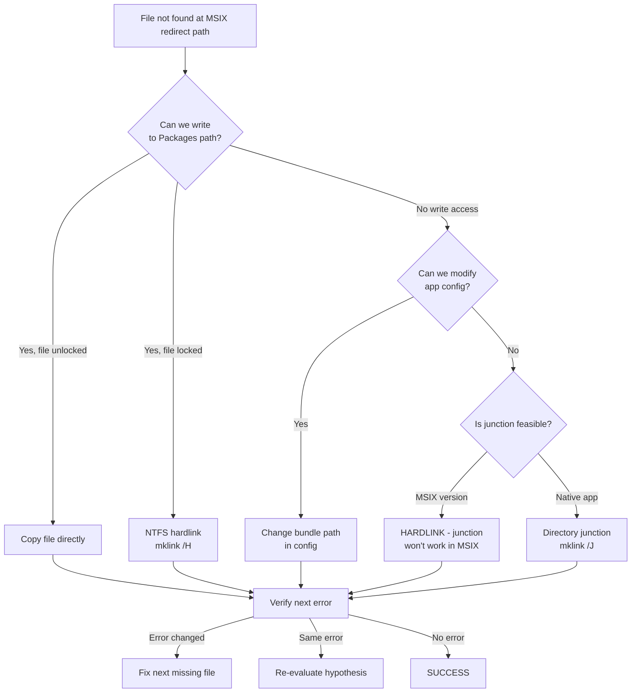

# MSIX Sandbox & File System Debugging

A systematic methodology for debugging **MSIX-packaged applications** where file system virtualization causes "file not found" errors, sandbox startup failures, or path resolution issues.

## Target Audience

- Developers debugging MSIX/AppX packaged apps
- Anyone troubleshooting sandbox/VM environments inside containerized apps
- Claude Code users whose desktop app features fail due to filesystem virtualization

## When to Use This Skill

Trigger when the problem involves:

- An MSIX-packaged app (installed from Windows Store or side-loaded)
- Error paths containing `Packages\...\LocalCache\Roaming\` or `Packages\...\LocalCache\Local\`
- "File not found" errors for files you can confirm exist on disk
- Sandbox/VM/container startup failures in packaged apps
- Cowork, Windows Sandbox, or similar isolated environments not starting
- Junction/symlink/reparse point approaches failing silently

## Core Methodology

### Step 0: Establish the Constraint Matrix

Before trying ANY solution, list the immutable constraints. Write them down explicitly.

**Template:**

```
CONSTRAINT MATRIX
────────────────────────────────────────────────
Authority    : [admin | user | container/LowIL]
Target       : [can kill | cannot kill]
File state   : [locked | unlocked | virtualized]
Environment  : [MSIX | AppX | native | WSL | Docker]
Network      : [direct | proxy | mirror | blocked]
Write access : [can write target | read-only]
```

**Real case example (Claude Desktop Cowork VM):**

| Constraint | Value | Implication |
|---|---|---|
| Authority | Non-admin | Can't use `fsutil hardlink`, VSS, or `mklink /D` |
| Target process | Cannot kill Claude Desktop | Killing it kills the debugging session too |
| File state | `rootfs.vhdx` (9.45GB) locked by Claude | Can't copy or move |
| Environment | MSIX-packaged (Windows Store) | Paths redirected to `Packages\...` |
| Network | DeepSeek API proxy | Can't re-download from Anthropic |
| Write access | Can write to `Packages\...` dir | Hardlinks are viable |

### Step 1: Logs First — Never Guess

MSIX-packaged apps typically write logs to:
- `%LOCALAPPDATA%\Claude-3p\logs\` (Claude Desktop)
- `%LOCALAPPDATA%\Packages\<package>\LocalCache\` (MSIX redirected)
- `%APPDATA%\...` (roaming data)

**Extract the exact error:**
```powershell
# Find all errors in the log
Select-String -Path "cowork_vm_node.log" -Pattern "error" | Select -First 20

# Find a specific time window
Select-String -Path "cowork_vm_node.log" -Pattern "2026-05-03 16:" | Select -First 30
```

**What to extract from each error:**
1. ✅ Full error message (not just summary)
2. ✅ The EXACT file path mentioned in the error
3. ✅ The stack trace (reveals which component failed)
4. ✅ The step name before the error (e.g., `Configuring Windows VM service...`)

### Step 2: Path Analysis — The Core Insight

**MSIX apps have TWO file system views:**

| User sees | MSIX app sees |
|---|---|
| `C:\Users\fanch\AppData\Local\Claude-3p\` | `C:\Users\fanch\AppData\Local\Packages\<pkg>\LocalCache\Roaming\Claude-3p\` |

This redirection is transparent to the app's JavaScript/Node.js code, but **native code** (C++, Swift, Rust) that calls Windows API functions like `CreateFile` or `SHGetKnownFolderPath` gets the **redirected path**.

**When you see an error path containing `Packages\...\LocalCache\Roaming\` — that's the MSIX redirect path. The file must physically exist there (or be linked there) for native code to access it.**

### Step 3: Solution Selection via Constraint Elimination

List all candidate solutions, then eliminate those that violate constraints:



**Solution reference table:**

| Technique | Command | Admin req? | Works in MSIX? | Zero-copy? | Notes |
|---|---|---|---|---|---|
| Directory junction | `mklink /J` | No | ❌ | ✅ | MSIX containers don't follow reparse points |
| File symlink | `mklink` | Yes* | Depends | ✅ | Needs admin or Developer Mode |
| NTFS hardlink | `mklink /H` | No | ✅ | ✅ | **Best for MSIX** — filesystem-level, no reparse point |
| File copy | `copy` / `Copy-Item` | No | ✅ | ❌ | Fails if source is locked |
| VSS shadow copy | `diskshadow` | Yes | ✅ | ❌ | Bypasses locks, but needs admin |
| Config change | Edit JSON/registry | Depends | ✅ | N/A | If app exposes a config option |

**\* = Windows 10/11 Developer Mode enables non-admin symlink creation**

### Step 4: NTFS Hardlinks — The MSIX Silver Bullet

**Why hardlinks work where junctions fail:**

```
Junction (mklink /J):
  Packages\Claude-3p ──[reparse point]──> AppData\Local\Claude-3p
  MSIX container: ⛔ Cannot traverse reparse point
  
Hardlink (mklink /H):
  Packages\...\rootfs.vhdx ──[same MFT entry]──> AppData\...\rootfs.vhdx
  MSIX container: ✅ Transparent — same data, different directory entry
```

**Creating hardlinks for an entire bundle:**
```powershell
$src = "C:\Users\fanch\AppData\Local\Claude-3p\vm_bundles\claudevm.bundle"
$dst = "C:\Users\fanch\AppData\Local\Packages\Claude_pzs8sxrjxfjjc\LocalCache\Roaming\Claude-3p\vm_bundles\claudevm.bundle"

$files = @("vmlinuz", "initrd", "smol-bin.vhdx", "vmlinuz.zst", "initrd.zst", "rootfs.vhdx.zst", "rootfs.vhdx")
foreach ($f in $files) {
    $sf = Join-Path $src $f
    $df = Join-Path $dst $f
    if (Test-Path $sf) {
        cmd.exe /c "mklink /H `"$df`" `"$sf`""
        Write-Host "$f - OK"
    }
}
```

**Removing a junction before creating hardlinks:**
```powershell
# Remove junction (reparse point) first
fsutil reparsepoint delete "C:\Users\fanch\AppData\Local\Packages\...\Claude-3p"

# OR via cmd (if fsutil fails)
cmd.exe /c "rmdir C:\Users\fanch\AppData\Local\Packages\...\Claude-3p"
```

**Important:** You must remove the junction first, otherwise `mklink /H` sees the source and destination as the same file (via junction resolution) and refuses to create the hardlink.

### Step 5: Incremental Verification

**The golden rule:** Fix one error → check the next → repeat until no errors.

```
Initial state:  "VHDX file not found: ...rootfs.vhdx"
  ↓ Fix rootfs.vhdx hardlink
Next state:     "kernel not found: ...vmlinuz"        ← PROGRESS!
  ↓ Fix vmlinuz hardlink
Next state:     "initrd not found: ...initrd"          ← PROGRESS!
  ↓ Fix initrd hardlink
Final state:    SUCCESS                                ← DONE
```

**Each error change is PROGRESS, not failure.** If the error stays the same after a fix, your fix didn't work — re-evaluate.

## Anti-Deadloop Framework

These rules prevent the most common debugging traps:

### Rule 1: The 15-Minute Hard Cap

**If a solution path produces no new information or error progress within 15 minutes, abandon it.** 

Signs of a dead loop:
- Re-testing the same hypothesis with minor variations
- "Let me just verify one more time..."
- The result is identical to the last 3 attempts
- You're researching why something that should work, doesn't

*In the Cowork case, junction was re-tested 4-5 times with identical results.*

### Rule 2: Constraint Elimination (Not Solution Hunting)

**Don't ask "What could work?" — Ask "What can't be eliminated?"**

1. List all possible approaches
2. Eliminate those that violate constraints
3. The only remaining approach is the answer, even if it's unintuitive

*Hardlinks were the unintuitive answer — nobody thinks "file system metadata trick" for a VM sandbox issue.*

### Rule 3: Two-Strike Rethink

**If two consecutive approaches fail, your problem model is wrong.** 

Do NOT try a third approach. Instead:
1. Re-read the raw error message
2. Re-examine the logs from scratch
3. Question your assumptions: "What if X is actually Y?"
4. Look for environmental factors you dismissed

*Junction failed → Copy failed (file locked). The correct reaction isn't "try harder at junctions" — it's "my approach to path resolution is fundamentally wrong."*

### Rule 4: Stay in Scope

**If the error is about file paths, don't touch networking. If it's about MSIX, don't touch WSL.**

Every moment spent on something outside the error's domain is wasted. Before taking any action, ask: "Does this directly address the error in the log?"

### Rule 5: Error Change = Progress (Celebrate It)

```diff
-❌ "Still not working, the error changed..."
+✅ "The error changed! We're moving forward."
```

A new error means:
- Your fix worked for the previous layer
- You've uncovered the next blocked step
- You're closer to the solution

## Case Study: Claude Desktop Cowork VM

**Original error:**
```
[VM:start] Startup failed: Error: failed to set VHDX path: VHDX file not found:
C:\Users\fanch\AppData\Local\Packages\Claude_pzs8sxrjxfjjc\LocalCache\Roaming\
Claude-3p\vm_bundles\claudevm.bundle\rootfs.vhdx
```

**Key observations:**
1. `bundlePath` in the log shows `AppData\Local\Claude-3p\...` (non-redirected path)
2. The error path contains `Packages\...\LocalCache\Roaming\` (MSIX-redirected path)
3. The Node.js code uses the non-redirected path (works fine)
4. The native VM Swift code resolves paths through MSIX redirection (fails)

**Root cause:**
The VM service (native Swift code loaded via `load_swift_api`) calls Windows APIs that return MSIX-redirected paths. It then tries to `CreateFile` on the redirected path. Directory junctions at the redirected path are not traversable by MSIX AppContainer processes.

**Fix:**
Replace directory junction with NTFS hardlinks for all bundle files at the physical Packages path.

```powershell
# Step 1: Remove the junction
fsutil reparsepoint delete "C:\Users\fanch\AppData\Local\Packages\Claude_pzs8sxrjxfjjc\LocalCache\Roaming\Claude-3p"

# Step 2: Create hardlinks for all 7 bundle files
mklink /H <packages_path>\rootfs.vhdx      <appdata_path>\rootfs.vhdx
mklink /H <packages_path>\vmlinuz           <appdata_path>\vmlinuz
mklink /H <packages_path>\initrd            <appdata_path>\initrd
mklink /H <packages_path>\smol-bin.vhdx     <appdata_path>\smol-bin.vhdx
mklink /H <packages_path>\vmlinuz.zst       <appdata_path>\vmlinuz.zst
mklink /H <packages_path>\initrd.zst        <appdata_path>\initrd.zst
mklink /H <packages_path>\rootfs.vhdx.zst   <appdata_path>\rootfs.vhdx.zst
```

**Validation:**
- Error #1: `rootfs.vhdx not found` → fixed → error changed to ↓
- Error #2: `vmlinuz not found` → fixed → no more errors → ✅ VM starts

## Reference: MSIX Virtualization Quick Reference

| Concept | Detail |
|---|---|
| What is MSIX? | Windows app packaging format. Apps run in a lightweight container with virtualized registry and file system. |
| File system redirect | `%APPDATA%` → `Packages\{identity}\LocalCache\Roaming\` |
| | `%LOCALAPPDATA%` → `Packages\{identity}\LocalCache\Local\` |
| | `%PROGRAMFILES%\WindowsApps\{identity}\` (app install) |
| Registry redirect | `HKCU\Software\{identity}` → isolated registry hive |
| Process type | "full trust" MSIX apps run as the user but through a filter driver |
| Junction limitation | MSIX filter driver does NOT traverse reparse points/junctions |
| Hardlink compatibility | NTFS hardlinks work transparently (filesystem-level, not filter-level) |
| Known folders API | `SHGetKnownFolderPath` returns redirected paths inside MSIX |

## Debugging Toolbox

```powershell
# Check if a path is a reparse point (junction/symlink)
(Get-Item "C:\path").Attributes -match "ReparsePoint"

# View junction target
(Get-Item "C:\path").Target

# Delete a reparse point
fsutil reparsepoint delete "C:\path"

# Check file lock
(&handle64.exe "C:\path\to\file")  # Requires Sysinternals
# OR via PowerShell (check if you can open with FileShare.None):
try { $f = [System.IO.File]::Open("C:\path", 'Open', 'Read', 'None'); $f.Close(); "Unlocked" }
catch { "Locked: $_" }

# Create hardlink
cmd.exe /c "mklink /H target.lnk source.dat"

# Check link count (should be 2+ for hardlinked files)
(Get-Item "C:\path\file.dat").LinkType  # "HardLink" if hardlinked

# Volume Shadow Copy (admin required)
# Used to copy locked files without stopping the owning process
diskshadow.exe
> set context persistent
> begin backup
> add volume C: alias shadow
> create
> expose %shadow% X:
> end backup
> exit
# Then copy from X:\Users\fanch\...\locked_file
```

## References

- [MSIX Documentation](https://learn.microsoft.com/en-us/windows/msix/)
- [MSIX App Container Capabilities](https://learn.microsoft.com/en-us/windows/uwp/packaging/app-capability-declarations)
- [NTFS Hard Links](https://learn.microsoft.com/en-us/windows/win32/fileio/hard-links-and-junctions)
